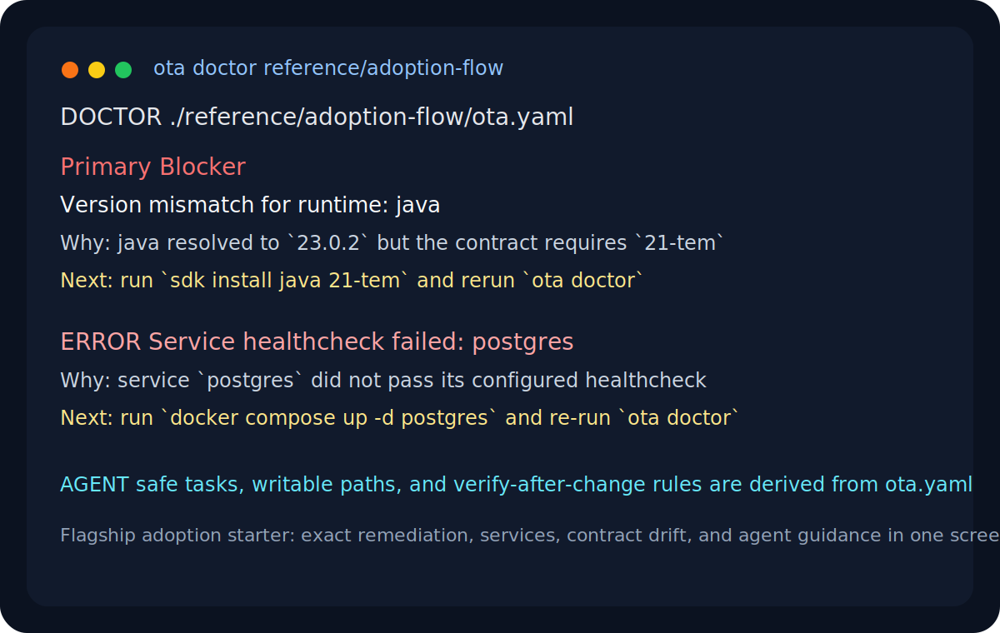
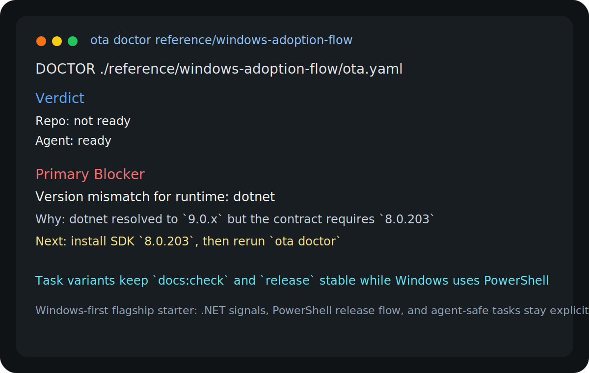

<!--
                █████
               ░░███
       ██████  ███████    ██████
      ███░░███░░░███░    ░░░░░███
     ░███ ░███  ░███      ███████
     ░███ ░███  ░███ ███ ███░░███
     ░░██████   ░░█████ ░░████████
      ░░░░░░     ░░░░░   ░░░░░░░░

   Copyright (C) 2026 — 2026, Ota. All Rights Reserved.

   DO NOT ALTER OR REMOVE COPYRIGHT NOTICES OR THIS FILE HEADER.

   Licensed under the Apache License, Version 2.0. See LICENSE for the full license text.
   You may not use this file except in compliance with that License.
   Unless required by applicable law or agreed to in writing, software distributed under the
   License is distributed on an "AS IS" BASIS, WITHOUT WARRANTIES OR CONDITIONS OF ANY KIND,
   either express or implied. See the License for the specific language governing permissions
   and limitations under the License.

   If you need additional information or have any questions, please email: os@ota.run
-->

# `ota-run/examples`

Collections of solid, real-world examples you can copy, adapt, and use to see how ota removes hidden setup, repeated explanations, and brittle workflow glue.

If you are introducing ota to a team, start with the adoption flows first. They show how ota earns trust before you move into CI, execution boundaries, or adapter patterns.

Use these as starting points when you want:
- a repo contract you can adapt quickly
- a first-week adoption flow for an existing repo
- a workspace contract for multi-repo setup
- a CI or release pattern built around `ota`
- an `execution` boundary when host drift or remote execution is the problem
- an `extensions` boundary when the repo needs custom check, export, or backend adapters

## Layout

- `templates/` - starter contracts you can copy into a new repo
- `ci/` - provider-specific CI patterns
- `execution/` - container and remote execution patterns
- `execution/local-topology/` - task target-binding patterns for helper apps and probes
- `execution/os-aware/` - OS-specific launcher examples
- `extensions/` - check, export, and backend adapter patterns
- `workspace/` - multi-repo workspace patterns
- `workspace/adoption-flow/` - workspace onboarding and first-week adoption pattern
- `reference/` - canonical, production-adjacent repo examples

## Choose by problem

- First contract: [`templates/node-service`](templates/node-service) or [`templates/python-service`](templates/python-service)
- Existing messy repo: [`reference/adoption-flow`](reference/adoption-flow)
  This is the flagship adoption starter. It now includes a real Java/Maven repo shape, a local service example, a task-prerequisite example with `requires_services`, docs, and release-script companions so users can copy more than just `ota.yaml`.
- Container app URL projection: [`execution/container/node-service`](execution/container/node-service)
  Use this when one canonical app task should support container and native execution modes, bind to fixed internal ports (`3000` app + `9090` metrics), let ota pick free host ports, inject `OTA_PUBLIC_URL` and listener-specific env values before startup, and print the same reachable primary URL for users.
- Fixed host URL + one-run override: [`reference/adoption-flow`](reference/adoption-flow)
  Use this when the task keeps a fixed projected host port in contract (`8080`) but operators sometimes need a predictable one-run public override like `ota run dev:api --host-port 4000` without changing the app’s internal bind.
- Internal task plumbing boundary: mark setup-only graph nodes with `internal: true`
  Use this when tasks like `setup` should still run through `depends_on`/hooks but should stay out of default operator discovery (`ota tasks`). Use `ota tasks --all` to inspect the full graph including internal nodes.
- Windows-first repo adoption: [`reference/windows-adoption-flow`](reference/windows-adoption-flow)
  This is the Windows-oriented flagship starter. It shows how ota keeps `.NET`, PowerShell release flow, and cross-platform task variants explicit without hiding the repo behind shell glue.
- Workspace adoption flow: [`workspace/adoption-flow`](workspace/adoption-flow)
- CI and release flow: [`ci`](ci)
- Container or remote execution: [`execution`](execution)
- Local helper app or probe targeting a repo-managed service: [`execution/local-topology/task-target-binding`](execution/local-topology/task-target-binding)
  Use this when a helper workload like a sandbox, SDK harness, or smoke probe should target one repo-managed app by service identity, keep an open override when needed, and stop hardcoding `localhost` or `host.docker.internal` as the primary contract truth.
- Co-located long-running helper app plus producer in one shared container boundary: [`execution/local-topology/shared-local-backend`](execution/local-topology/shared-local-backend)
  Use this when both workloads are intentional long-running container tasks and ota should treat them as one shared local backend so `address_view: topology` resolves to the producer's in-boundary address without host bridge hacks.
- Shared local backend plus backend preparation on the actual run path: [`execution/local-topology/shared-local-backend-fulfillment`](execution/local-topology/shared-local-backend-fulfillment)
  Use this when one shared backend shape should stay explicit but ota also needs to prepare the effective runtime/tool union before any bound task or dependency executes.
- OS-specific launchers or platform branching: [`execution/os-aware`](execution/os-aware)
- Custom adapters and backend providers: [`extensions`](extensions)
- Multi-repo bootstrap: [`workspace/monorepo`](workspace/monorepo)
- Serious repo reference shape: [`reference/canonical-team-repo`](reference/canonical-team-repo) or [`reference/swift-service`](reference/swift-service)

## Example types

- Starter contract: minimal copyable `ota.yaml` with a short README
- Flagship adoption starter: contract plus repo signals, docs, and companion files that show obvious `doctor -> explain -> detect -> up -> agents` value
- Windows-first flagship starter: a reference example that keeps `.NET`, PowerShell, and cross-platform variants explicit
- Canonical advanced reference: production-adjacent repo shape that teaches a full operating model
- Workspace reference: multi-repo bootstrap and adoption ordering

## Terminal previews

These are small terminal previews of the flagship examples. They are not mock marketing copy; they are meant to look like the real value users should expect from Ota.
They are illustrative, not byte-for-byte transcripts. Wording can shift as the CLI evolves.

## How to use

1. Pick the folder that matches the problem you are solving.
2. Read that folder's `README.md` first to understand why the pattern exists.
3. Open its `ota.yaml` for the exact contract and task notes.
4. Copy only the files you need.
5. Run `ota validate .` or `ota workspace validate .` before you ship the pattern.

## Validate this repo

Run `ota run validate` before opening a pull request.

## Dogfood this repo

Run `ota run dogfood` when Ota UX changes and you want to re-check the flagship examples against the current local CLI behavior.

## What these examples are teaching

- the repo shape and use-case for each example
- when to use the example
- what problem the example solves
- where to open the example's `ota.yaml` for task-level instructions

## Contributing

- Read [`CONTRIBUTING.md`](CONTRIBUTING.md) before opening a pull request.
- Use the pull request and issue templates under [`.github/`](.github/).
- Follow [`CODE_OF_CONDUCT.md`](CODE_OF_CONDUCT.md).
- See [`SECURITY.md`](SECURITY.md) for security disclosures.
- See [`SUPPORT.md`](SUPPORT.md) for help and response expectations.
